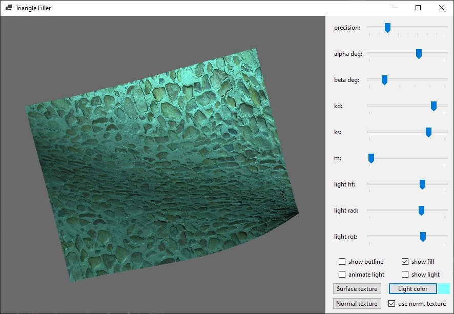

# Triangle Mesh Filler

## Introduction

The project is an interactive 3D surface and lighting model written
using C# and Windows Forms. It provides the user with a Bézier surface,
lighting properties of which can be changed, along with modifying position
of the surface and the light itself. Moreover, the application provides
support for applying textures and normal maps to the surface. The application
uses self-written methods for filling polygons and simulating lighting.

## Installation and compilation

The project has been tested on a Windows 10 device, 
and compiled using .NET 8.0. Note that as a WinForms project, 
it isn't suited for being used on operating systems other 
than Windows.

If you want to compile the application on your device, install the program, by running `git clone` on this repository:
```shell
git clone https://github.com/kubapoke/triangle-mesh-filler
```
Subsequently, run:
```shell
dotnet build <solution-file>
```
Where `<solution-file>` should be the path to the provided `TriangleMeshFiller.sln` file.
This requires having `dotnet` installed.

## Usage
Run the program by running
```shell
./TriangleMeshFiller
```
in the executable folder, or manually opening the 
```TriangleMeshFiller.exe``` file.

Note that the program requires access to the ```Assets``` directory in its 
executable directory, so depending on your setup it might be necessary
to move the directory into an appropriate location.

After running the application, you will be presented with the initial
Bézier surface, with an animated light circling around it.


The Bézier surface is defined by 16 control points, which can be modified by editing ```input1.txt``` to change their positions.


### Controls

You will be met with several sliders and other interactive components,
the meaning of which is explained below:

#### Sliders
* ```precision``` - modifies the amount of triangles the surface is
composed of
* ```alpha deg``` - rotates the surface around the z axis
* ```beta deg``` - rotates the surface around the x axis 
* ```kd``` - changes the diffuse component value in the lighting model
* ```ks``` - changes the specular component value in the lighting model
* ```m``` - changes the specular shininess value in the lighting model
* ```light ht``` - changes height of the light
* ```light rad``` - changes radius of the light (in relation to the 0 coordinate)
* ```light rot``` - changes rotation of the light (in relation to the 0 coordinate)
#### Checkboxes
* ```show outline``` - whether the grid of triangles is shown
* ```show fill``` - whether the coloring of the triangles is shown
* ```animate light``` - whether the light rotates by itself around the plane
* ```show light``` - whether the light is shown
* ```use norm. texture``` - whether the normal map provided is used
#### Buttons
* ```Surface texture``` - changes the texture on the plane
* ```Normal texture``` - changes the normal map used for the plane
* ```Light color``` - changes the color of the light

This is how the surface could look after modifying some of the initial settings:



All textures and normal maps included in this project are sourced from
the [Poly Haven](https://polyhaven.com) website.